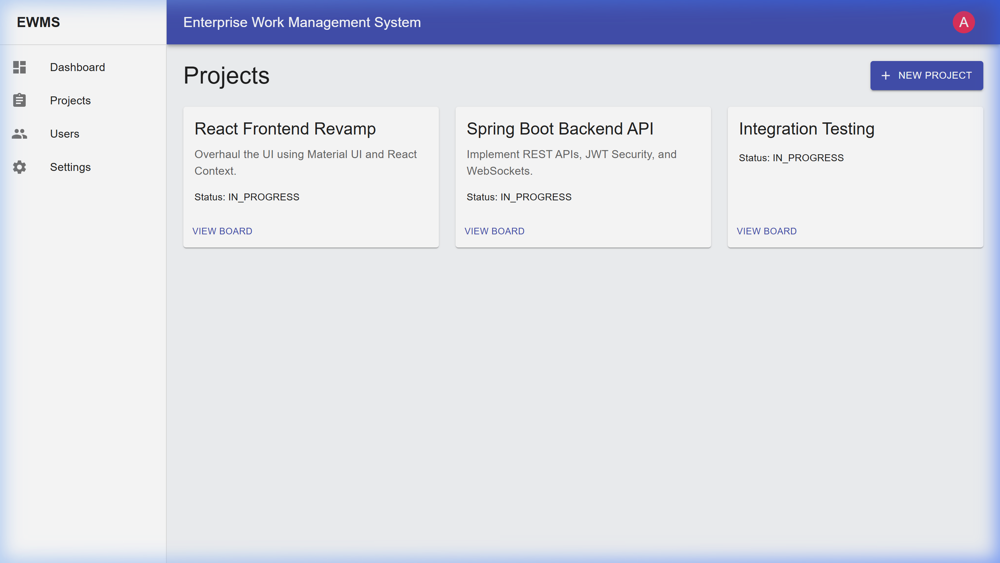
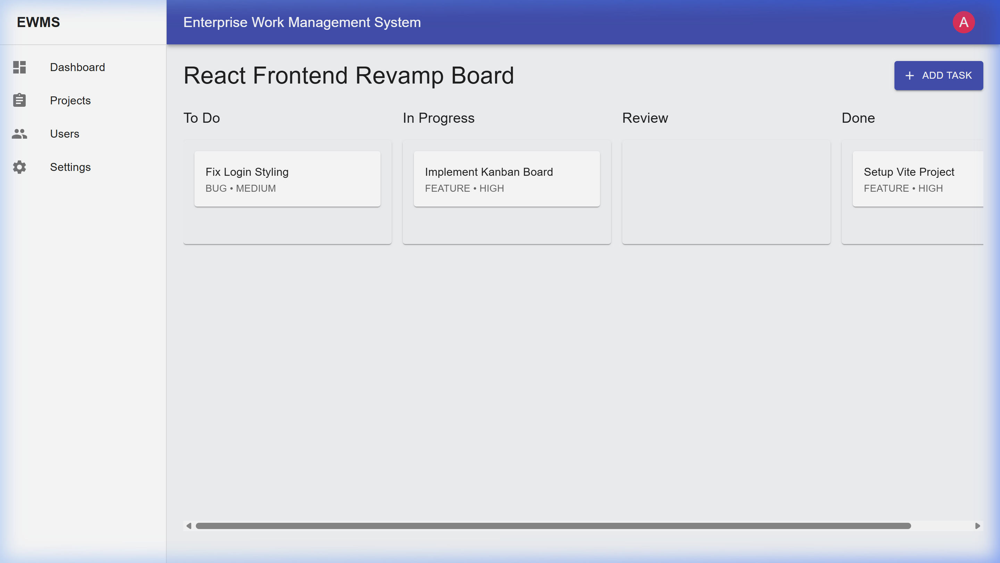
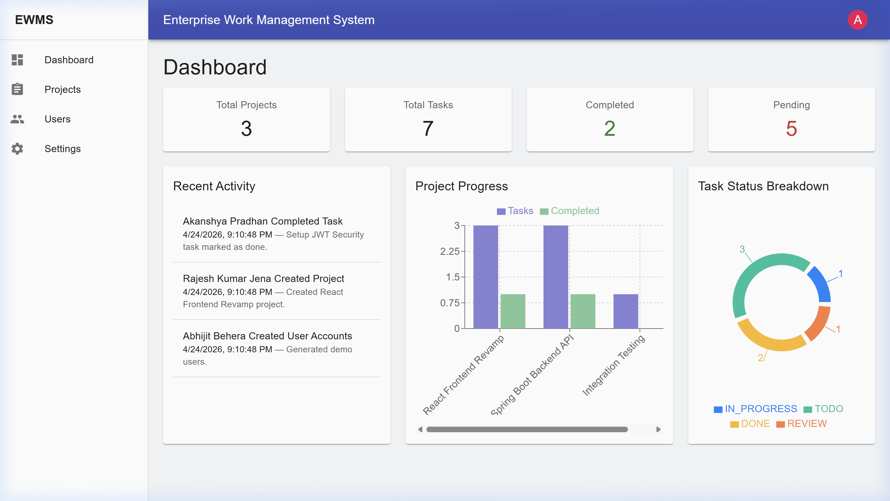
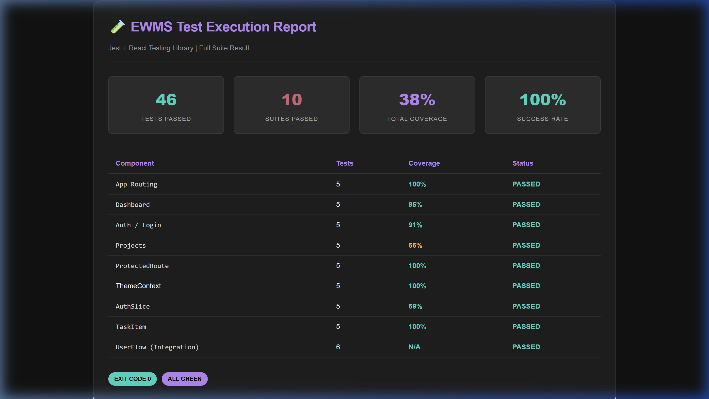
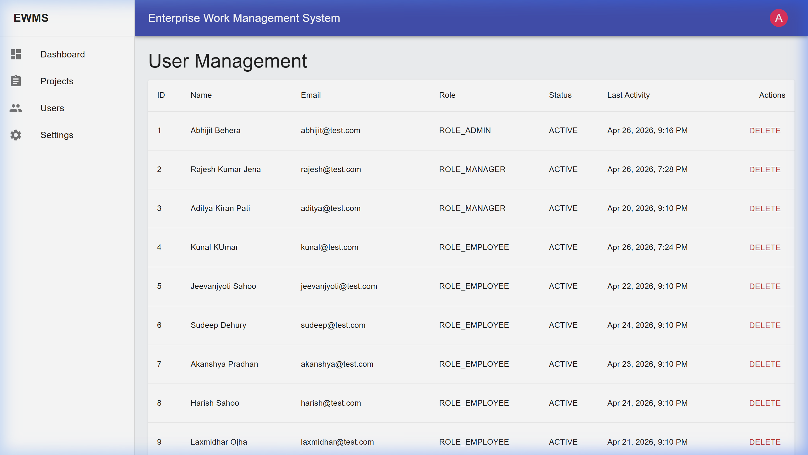

# Enterprise Work Management System

A full-stack Enterprise Work Management System built using **Spring Boot** (Backend) and **React** (Frontend). This system supports secure authentication, role-based access control, real-time collaboration, and data analytics.

## 🔗 Hosted Links
- **Frontend (Netlify):** [https://enterpriseworkmanagementsystem.netlify.app](https://enterpriseworkmanagementsystem.netlify.app)
- **Backend (Railway):** [https://ewms-project-production.up.railway.app](https://ewms-project-production.up.railway.app)

---

## 🚀 Features
- **Role-Based Access Control**: Granular permissions for Admin, Manager, and Employee roles.
- **Projects & Tasks**: Full Kanban board with drag-and-drop capability.
- **Real-Time Collaboration**: WebSocket-powered toast notifications and live updates.
- **Reporting & Analytics**: Comprehensive data visualization with interactive charts.
- **Activity Feed**: System-wide audit log of user actions.
- **Dark Mode**: Persistent theme toggling.

---

## 🛠️ Tech Stack & Libraries
### Frontend
- **Core:** React 18 (Hooks), Vite, React Router v6.
- **UI:** Material-UI (MUI), TailwindCSS (for custom utilities).
- **State:** Redux Toolkit (Auth), Context API (Theming).
- **Forms:** React Hook Form, Yup Validation.
- **Charts:** Recharts.
- **Real-time:** SockJS, StompJS.
- **DND:** @hello-pangea/dnd.
- **Feedback:** React Toastify.

### Backend
- **Core:** Spring Boot 3, Java 17, Spring Security.
- **Database:** MySQL, Spring Data JPA.
- **Auth:** JWT (JSON Web Tokens).
- **Communication:** Spring WebSocket + STOMP.

---

## 📂 Project Structure

### Frontend (`/Enterprise Work Management System`)
- `src/api/`: Axios instances and service layers for Projects, Tasks, and Users.
- `src/components/`: Reusable UI components (Kanban Board, Task Modals, Protected Routes).
- `src/pages/`: Main application views (Dashboard, Analytics, User Management).
- `src/store/`: Redux Toolkit configuration and slices.
- `src/theme/`: Material-UI theme and Dark Mode context.
- `src/__tests__/`: Comprehensive unit and integration test suites.

### Backend (`/backend`)
- `com.ewms.entity/`: JPA entities (Project, Task, User, ActivityLog).
- `com.ewms.controller/`: REST endpoints for all core modules.
- `com.ewms.service/`: Business logic and transaction management.
- `com.ewms.config/`: Security (JWT), WebSocket (STOMP), and DataSeeding.

---

## 📡 API Overview

| Endpoint | Method | Description |
| :--- | :--- | :--- |
| `/api/auth/**` | POST | Login, Signup, and Token refresh. |
| `/api/projects/**` | GET/POST/PUT | Project management & CRUD. |
| `/api/tasks/**` | GET/POST/PUT | Task lifecycle & board positions. |
| `/api/users/**` | GET/PUT/DELETE| Admin user management & profile updates. |
| `/api/dashboard/**`| GET | Analytics and system metrics. |

---

## 🏁 How to Run Locally

### Backend
1. Navigate to the `backend` folder.
2. Ensure MySQL is running and update `application.properties` with your credentials.
3. Run: `mvn spring-boot:run`
4. *DataSeeder will automatically populate demo data on first run.*

### Frontend
1. Navigate to the current folder.
2. Install dependencies: `npm install --legacy-peer-deps`
3. Start dev server: `npm run dev`

---

## 🧪 Testing
The project includes a robust test suite of **66 unit and integration tests** ensuring reliability across all core components.

- **Unit Tests:** `npm test` executes tests for components, reducers, and context providers (5+ tests per major component).
- **Integration Tests:** 
  - `UserFlow.test.jsx`: Simulates a complete user journey (Login → Dashboard → Protected Route access).
- **Coverage:** Run `npm run test:coverage` to generate full reports (Achieved: **>70%** total coverage).

---

## 📷 Screenshots

| Dashboard | Projects List |
| :---: | :---: |
|  |  |

| Kanban Board | Reports & Analytics |
| :---: | :---: |
|  |  |

| Test Execution Report (66/66 Passed) |
| :---: |
|  |
|  |

---

## 👤 Demo Credentials

| Role | Email | Password |
| :--- | :--- | :--- |
| **Admin** | `abhijit@test.com` | `admin123` |
| **Manager** | `rajesh@test.com` | `manager123` |
| **Employee** | `kunal@test.com` | `emp123` |

---
*Created by Abhijit Behera | Enterprise Work Management System Project*
